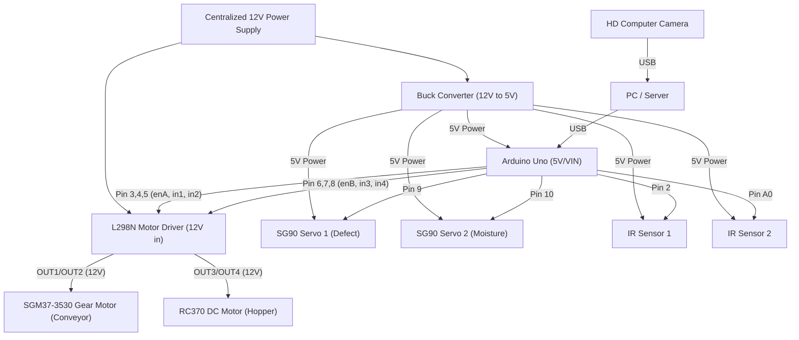

# SILK_OS v1.0 — Cocoon YOLO Sorting Machine Dashboard

A real-time IoT sorting machine dashboard powered by YOLOv11 object detection, Arduino hardware control, and a Flask backend. The system classifies silk cocoons via a live webcam feed and routes them through a conveyor + servo sorting mechanism.

---

## Project Structure

```
cocoon_yolo/
├── app.py                 # Flask backend (webcam feed, YOLO inference, serial, API)
├── app.js                 # Frontend polling logic & DOM updaters
├── index.html             # Dashboard UI (Tailwind CSS)
├── cocoon_yolo.ipynb      # Jupyter notebook (YOLO training/testing)
├── cocoon_model.pt        # Trained YOLOv11 model file
├── firmware/
│   └── firmware.ino       # Arduino firmware (non-blocking, millis-based)
└── README.md              # This file
```

---

## Prerequisites

### Software

| Tool | Version | Purpose |
|------|---------|---------|
| **Python** | 3.8+ | Backend server runtime |
| **pip** | Latest | Python package manager |
| **Arduino IDE** | 2.x | Flashing firmware to microcontroller |
| **Web Browser** | Chrome / Edge / Firefox | Viewing the dashboard |
| **Git** *(optional)* | Latest | Version control |

### Hardware

| Component | Description |
|-----------|-------------|
| **SGM37-3530 DC12V 333RPM Gear Motor** | Drives the Conveyor Belt |
| **RC370 DC Motor 12V** | Drives the Hopper for cocoon feeding |
| **2× SG90 Servo Motors** | Sorting gate mechanism (Defect vs High Moisture) |
| **2× IR Sensors** | IR1 (Digital) for Defect trigger, IR2 (Analog) for Moisture |
| **Buck Converter** | Steps down 12V to 5V for Arduino and Servos |
| **Centralized 12V Power Supply** | Main power for the entire system |
| **L298N Motor Driver** | Controls both the Conveyor Belt and Hopper Motors |
| **Arduino Uno** | Main Microcontroller |
| **HD Computer Camera** | Webcam for YOLO feed and defect detection |

---

## Hardware Schematic Diagram



---

## Installation

### 1. Clone the Repository

```bash
git clone https://github.com/your-username/cocoon_yolo.git
cd cocoon_yolo
```

### 2. Install Python Dependencies

```bash
pip install flask opencv-python pyserial ultralytics
```

| Package | Purpose |
|---------|---------|
| `flask` | Web server serving the dashboard and API |
| `opencv-python` | Webcam capture and image processing |
| `pyserial` | Serial communication with Arduino |
| `ultralytics` | YOLOv11 engine for real-time inference |

### 3. Flash the Arduino Firmware

1. Open `firmware/firmware.ino` in the **Arduino IDE**.
2. Install the **Servo** library if not already present (comes built-in with most Arduino IDE installs).
3. Select your board (e.g., **Arduino Uno**) and the correct **COM port** from `Tools > Port`.
4. Click **Upload** (→ button).

#### Default Pin Wiring

| Component | Arduino Pin |
|-----------|-------------|
| L298N `ENA` (PWM) | `3` |
| L298N `IN1` | `4` |
| L298N `IN2` | `5` |
| L298N `ENB` (PWM) | `6` |
| L298N `IN3` | `7` |
| L298N `IN4` | `8` |
| IR Sensor 1 (Digital) | `2` |
| IR Sensor 2 (Analog) | `A0` |
| Servo 1 | `9` |
| Servo 2 | `10` |

> **Note:** Modify the pin constants at the top of `firmware.ino` if your wiring differs.

---

## Configuration

### Set the COM Port (Python)

Open `app.py` and change the `COM_PORT` variable to match your Arduino's serial port:

```python
# app.py — Line 21
COM_PORT = 'COM3'  # Windows: COM3, COM4, etc.
                   # macOS:   /dev/tty.usbmodem14101
                   # Linux:   /dev/ttyUSB0 or /dev/ttyACM0
```

To find your port:
- **Windows:** Open Device Manager → Ports (COM & LPT)
- **macOS/Linux:** Run `ls /dev/tty*` in a terminal

### Real-time Telemetry
The dashboard is now strictly connected to hardware telemetry. Mock data generation has been removed to ensure production accuracy. Ensure the Flask server is running and the Arduino is connected to see live updates.

---

## Running the Project

### Step 1: Connect your Arduino via USB

Make sure the firmware is already flashed and the board is powered.

### Step 2: Start the Flask Server

```bash
python app.py
```

You should see:

```
Successfully connected to Arduino on COM3
 * Running on http://0.0.0.0:5000
```

> If the Arduino is not connected, the server will print a warning but **still start** — the webcam feed and YOLO inference will work fine.

### Step 3: Open the Dashboard

Open your browser and navigate to:

```
http://localhost:5000
```

> **Note:** The dashboard must be accessed via the Flask server URL. Opening `index.html` directly as a file will not work because the video feed and API calls require the Flask backend.

---

## System Logic & Pipeline

### 1. Data Flow (Telemetry Pipeline)
The system operates in a continuous loop across four layers:
1.  **Hardware (Arduino)**: Runs a precise state machine (Feeding → Moving to Camera → Waiting for YOLO → Checking Moisture → Sorting/End). Every 500ms, it sends state metrics (Conveyor, Hopper, IR) as a JSON string via Serial.
2.  **Backend (Python)**: A background thread reads the Serial stream and updates the `latest_telemetry` object. It also processes YOLO frames, and when the Arduino waits at the camera, sends back sorting commands.
3.  **API (Flask)**: Serves the telemetry object at the `/api/telemetry` endpoint.
4.  **Frontend (JS)**: Polls the API every 500ms and updates the Dashboard UI (LEDs, Counters, Moisture Dial).

### 2. State Machine Flow
- **`IDLE` to `FEEDING`**: The Hopper Motor runs to drop a cocoon onto the belt.
- **`MOVING_TO_CAM`**: Conveyor runs until IR Sensor 1 detects the cocoon.
- **`WAITING_CAM_RESULT`**: Conveyor pauses. The Python app analyzes the HD Camera feed using YOLO and sends `DEFECT:YES` or `DEFECT:NO`.
- **`CHECK_MOISTURE`**: The Conveyor runs to IR Sensor 2 to measure moisture.
- **`SORTING` / `MOVE_TO_END`**: Servo 1 sweeps bad cocoons, Servo 2 sweeps high-moisture cocoons, and good cocoons drop at the end of the belt. The system continuously tallies `good`, `bad`, and `total` counters automatically.

---

## API Reference

| Endpoint | Method | Description |
|----------|--------|-------------|
| `/` | GET | Full dashboard UI (serves `index.html`) |
| `/video_feed` | GET | MJPEG webcam stream |
| `/api/telemetry` | GET | Latest hardware telemetry as JSON |

### Example `/api/telemetry` Response

```json
{
  "metrics": {
    "total": 142,
    "good": 128,
    "bad": 14,
    "fps": "29.8"
  },
  "hardware": {
    "motorA": "RUNNING",
    "hopper": "STOPPED",
    "ir1": "CLEAR"
  },
  "environment": {
    "moisture": 512
  }
}
```

---

## Serial Commands (Python → Arduino)

The Flask backend (or any serial terminal) can send these commands to the Arduino:

| Command | Direction | Description |
|---------|-----------|-------------|
| `START` | PC → Arduino | Initializes the sorting state machine |
| `STOP` | PC → Arduino | Stops all motors and returns to IDLE |
| `DEFECT:YES` | PC → Arduino | YOLO detected a defect. Tells Arduino to sort via Servo 1 |
| `DEFECT:NO` | PC → Arduino | YOLO passed the cocoon. Tells Arduino to proceed to moisture check |
| `{"metrics":{...}}` | Arduino → PC | Real-time JSON telemetry payload sent every 500ms |
| `[DEBUG] ...` | Arduino → PC | Plain text debug logs (printed to the Python console) |

---

## Troubleshooting

| Problem | Solution |
|---------|----------|
| `ModuleNotFoundError: No module named 'serial'` | Run `pip install pyserial` (not `pip install serial`) |
| `Could not connect to Arduino on COM3` | Check the correct COM port in Device Manager and update `COM_PORT` in `app.py` |
| Camera feed shows "STREAM OFFLINE" | Ensure your webcam is connected and not used by another app |
| Dashboard shows `CONN_LOST` | Verify the Flask server is running on port 5000 |
| Arduino serial output is garbled | Confirm baud rate is `9600` in both `firmware.ino` and `app.py` |
| `cv2` import error | Run `pip install opencv-python` |
| `Failed to load cocoon_model.pt` | Ensure `cocoon_model.pt` is in the project root directory |
| Low FPS / Laggy stream | YOLO inference is CPU/GPU intensive; ensure high-performance mode or a dedicated GPU |

---

## License

This project is for educational and research purposes.
